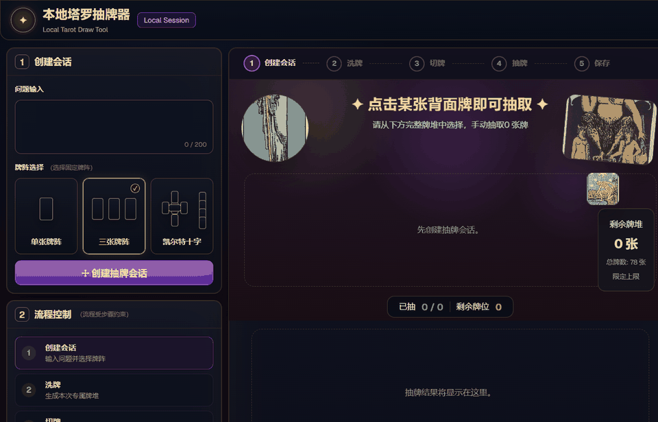
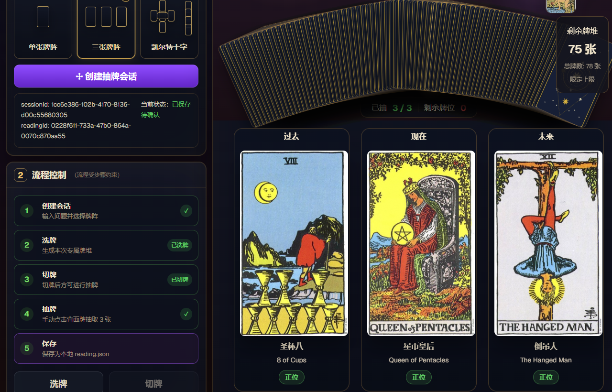
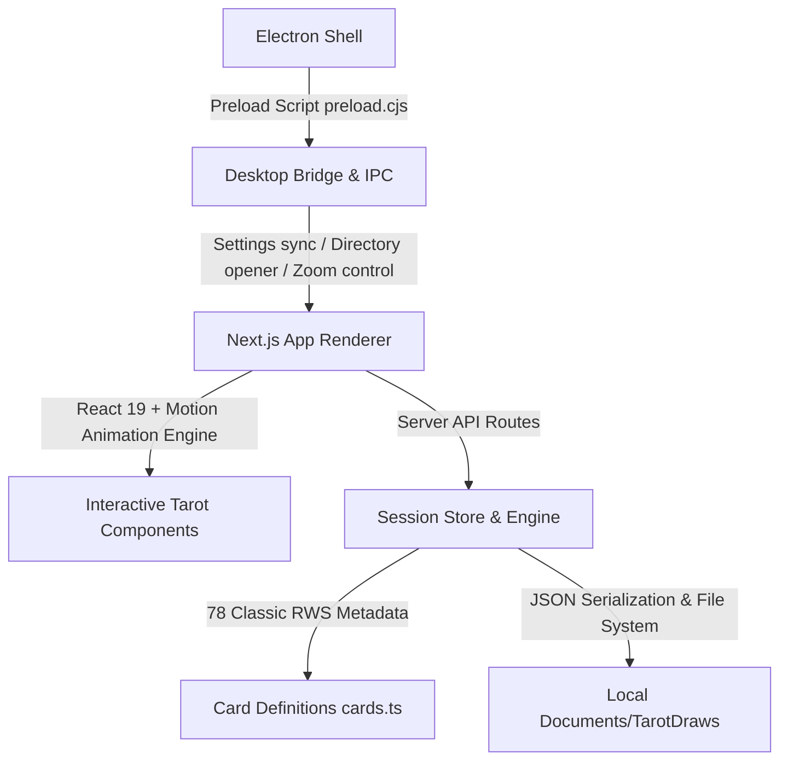

# Local Tarot Draw (本地塔罗抽牌器)

<div align="center">

**English** | [简体中文](README.md)

[](LICENSE)
[](https://github.com/divenire990/local-tarot-draw/releases)
[](https://nodejs.org/)
[](https://nextjs.org/)
[](https://www.electronjs.org/)

**A completely offline, privacy-first, and ritual-oriented modern open-source cross-platform Tarot drawing and reading archive tool.**

</div>

---

## 📖 Table of Contents

- [✨ Key Features](#-key-features)
- [🎬 Live Demo & Screenshots](#-live-demo--screenshots)
- [🔒 Privacy & Offline Guarantee](#-privacy--offline-guarantee)
- [🏛️ System Architecture](#️-system-architecture)
- [🚀 Quickstart](#-quickstart)
- [📦 Production Build & Desktop Packaging](#-production-build--desktop-packaging)
- [📜 Deck Artwork Provenance & Licensing](#-deck-artwork-provenance--licensing)
- [🤝 Contributing & Security](#-contributing--security)

---

## ✨ Key Features

- **Classic 78-Card Public Domain Rider-Waite-Smith Deck**: Faithfully includes the complete original 1909 Rider-Waite-Smith deck, featuring 22 Major Arcana and 56 Minor Arcana (Wands, Cups, Swords, Pentacles), completely free from proprietary recoloring copyright entanglements.
- **Sacred Geometry Symmetrical Card Back**: Custom-designed celestial eight-pointed star and sacred geometry back art (CC0 1.0 Universal), ensuring full unpredictability of upright and reversed card orientations.
- **Immersive Ritual Workflow**:
  - **Session Initialization**: Enter your inquiry, select target spread.
  - **Deck Shuffling**: Cryptographically pseudo-random shuffle with independent 50% reversal probability and fan dispersion animation.
  - **Ritual Cutting**: Traditional cut action to reorder card layers before draw.
  - **Manual Card Selection**: Fanned-out card deck allowing manual user pick, accompanied by smooth card flight and flip animations.
- **Multiple Classic Tarot Spreads**:
  - **Single Card Spread**: Daily guidance or concise answers.
  - **Three-Card Spread (Holy Triangle)**: Explore the temporal progression of "Past · Present · Future".
  - **Celtic Cross Spread**: In-depth holistic analysis of complex situations and root causes.
- **Rich & Precise Interpretation Panel**: Real-time display of bilingual card names, upright/reversed status, key symbolic imagery, and advice.
- **Strictly Local JSON Persistence**: One-click save to structured `reading.json` files organized cleanly in local storage with timestamps and spread metadata.
- **Dual-Mode Cross-Platform Experience**: Runs both as a lightweight web application and as a standalone Electron desktop application, with dark theme switching (Night / Dusk) and smooth window zoom scaling.

---

## 🎬 Live Demo & Screenshots

### True Workflow Demo

The following animation demonstrates the full genuine user workflow: creating a session, shuffling, cutting, and drawing three cards (8 of Cups, Queen of Pentacles, etc.) from the deck:



### Reading & Spread Interface

Upon completion of drawing, all card slots, upright/reversed indicators, and in-depth interpretation details are displayed:



---

## 🔒 Privacy & Offline Guarantee

Tarot inquiries and reflections are deeply personal. **Local Tarot Draw** adheres to uncompromising privacy principles:

1. **Strictly Offline Functional**: Operates completely without an Internet connection; all computation occurs locally in the Node.js / Electron process and browser runtime.
2. **Zero Remote Telemetry**: Contains no telemetry beacons, analytics SDKs, trackers, or external cloud requests.
3. **Local Sandboxed Storage**: All reading archives are stored in the user's local directory (default: `Documents/TarotDraws`), completely owned and controlled by the user.

---

## 🏛️ System Architecture



- **Presentation Layer**: Built with Next.js 16 (App Router) + React 19, styled with Tailwind CSS 4 in an esoteric dark aesthetic, animated with Motion.
- **Core Engine Layer**: Robust Zod schemas (`schemas.ts`) validating state transitions for session creation, shuffle, cut, and draw operations.
- **Portable Configuration & Desktop Integration**: Resolves to the user's home documents directory cross-platform, with optional `TAROT_RECORDS_DIR` environment override support; packaged with an embedded Next.js standalone server for Electron.

---

## 🚀 Quickstart

### Approach 1: Fast Launch & Install via npm / npx (Recommended for Windows)

Run directly in your terminal without cloning the repository:

```bash
npx @divenire990/local-tarot-draw
```

Or install globally and invoke anywhere:

```bash
npm install -g @divenire990/local-tarot-draw
local-tarot-draw
```

#### Command-Line Options

```text
local-tarot-draw [options]

Options:
  -y, --yes            Skip launch confirmation after SHA-256 verification
  -d, --download-only  Download and verify installer without launching
  -o, --output-dir     Directory to store the verified installer
  -v, --version        Display CLI version
  -h, --help           Display help message and security behavior
```

#### 🔒 CLI Security Architecture & Guarantees

1. **Zero External Runtime Dependencies**: Built entirely with Node.js 20+ native standard library modules, preventing software supply chain tampering.
2. **No Postinstall Scripts**: The package contains no install hooks. Network operations occur exclusively when explicitly executed by the user.
3. **Strict Domain Whitelist & HTTPS**: All network traffic is strictly confined to official GitHub Releases (`divenire990/local-tarot-draw`) and official CDN domains over HTTPS.
4. **Streaming SHA-256 Cryptographic Verification**: The installer binary is streamed and hashed, then strictly compared against the official `.sha256` asset. **If the hash does not match, the file is deleted immediately and will never be launched**.
5. **No-Shell Process Spawning & User Confirmation**: An interactive confirmation prompt is required before launching (unless `--yes` is specified). The executable is spawned directly with `shell: false`, eliminating command injection vectors.

#### 💻 Platform Support

- **Windows**: Full automated download, SHA-256 verification, and installer launch.
- **macOS / Linux**: The desktop installer (`.exe`) is packaged for Windows. On non-Windows platforms, the CLI provides friendly instructions with links to GitHub Releases and local web setup.

#### 📦 Direct Release Download Alternative

If you prefer manual installation without Node.js or npm, download assets and checksums directly:
- **GitHub Releases Page**: [https://github.com/divenire990/local-tarot-draw/releases](https://github.com/divenire990/local-tarot-draw/releases)

---

### Approach 2: Clone & Local Web Mode (Cross-Platform)

#### Prerequisites

- [Node.js](https://nodejs.org/) `>= 20.0.0`
- `npm` `>= 10.0.0`

#### Clone & Install

```bash
git clone https://github.com/divenire990/local-tarot-draw.git
cd local-tarot-draw
npm install
```

#### Development

- **Web Development Mode**:
  ```bash
  npm run dev
  ```
  Open [http://localhost:3000](http://localhost:3000) in your browser.

- **Desktop Development Mode (Next.js + Electron)**:
  ```bash
  npm run dev:desktop
  ```
  Launches the Next.js development server and the native Electron window.

#### Tests & Linting

```bash
# Run unit and integration tests with coverage
npm test

# Run CLI package tests
npm run test:cli

# Run ESLint check
npm run lint
```
---

## 📦 Production Build & Desktop Packaging

### 1. Production Web Build

```bash
npm run build
npm run start
```

### 2. Windows Desktop Installer Build

Packaged using `electron-builder` into a standalone Windows NSIS installer (`.exe`):

```bash
npm run build:desktop
```

The resulting files are output to `dist-desktop/`:
- `LocalTarotDraw-Setup-0.1.0.exe`: Standard Windows installer with custom installation directory selection, desktop shortcut creation, and start menu integration.

Users can also download pre-built installers directly from the [Releases](https://github.com/divenire990/local-tarot-draw/releases) page.

---

## 📜 Deck Artwork Provenance & Licensing

- **Card Faces (Rider-Waite-Smith Tarot Deck, 1909)**:
  - Artist: Pamela Colman Smith (1878–1951)
  - Direction: Arthur Edward Waite (1857–1942)
  - Publisher: William Rider & Son, London (December 1909)
  - Copyright Status: **Public Domain** (Published before 1931 in the United States; copyright expired under the life+70 post mortem auctoris rule in the United Kingdom, European Union, and jurisdictions with applicable life+70 or shorter terms).
  - Original Art vs. Modern Recoloring: Faithfully presents digitized historical scans of the original 1909 edition; strictly excludes any modern proprietary recolored or remastered editions holding separate commercial copyrights.
  - Legal Disclaimer: The copyright analysis provided is for informational reference only and does not constitute legal advice. Because copyright terms vary across jurisdictions (some exceeding life+70) and legal standards for non-original digital scans differ, downstream users and redistributors must independently verify local copyright laws.
  - Exact Clickable Provenance: Digital package sourced from [`tarot-card-img` (v0.1.0)](https://www.npmjs.com/package/tarot-card-img) on npm; upstream historical archive cataloged at [Wikimedia Commons: Category:1909 Rider-Waite-Smith tarot deck](https://commons.wikimedia.org/wiki/Category:1909_Rider-Waite-Smith_tarot_deck).
- **Card Back Artwork**: Custom sacred geometry symmetrical eight-pointed star design released under **[CC0 1.0 Universal (Public Domain)](https://creativecommons.org/publicdomain/zero/1.0/)**.
- **Source Code License**: Released under the **MIT License**.
- For complete file-level mappings, authoritative archive links, and third-party library licenses, see [THIRD_PARTY_NOTICES.md](THIRD_PARTY_NOTICES.md) and [LICENSE](LICENSE).
---

## 🤝 Contributing & Security

- **Contributions**: Issues and Pull Requests are warmly welcome! See [CONTRIBUTING.md](CONTRIBUTING.md) for guidelines.
- **Security Inquiries**: For reporting security or privacy concerns, please consult [SECURITY.md](SECURITY.md).
