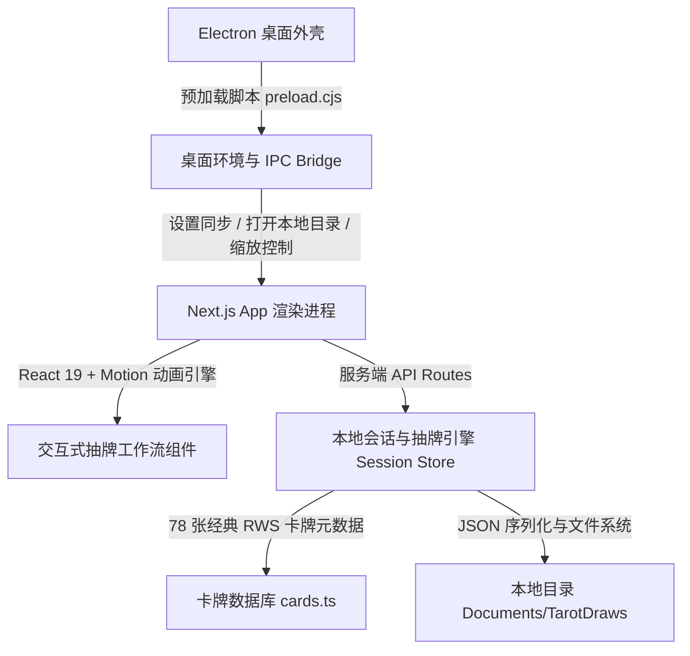

# 本地塔罗抽牌器 (Local Tarot Draw)

<div align="center">

[English](README.en.md) | **简体中文**

[](LICENSE)
[](https://github.com/divenire990/local-tarot-draw/releases)
[](https://nodejs.org/)
[](https://nextjs.org/)
[](https://www.electronjs.org/)

**一款完全离线、注重隐私保护、遵循经典仪式感的开源现代化跨平台塔罗抽牌与推演记录工具。**

</div>

---

## 📖 目录

- [✨ 核心特性](#-核心特性)
- [🎬 操作演示与界面](#-操作演示与界面)
- [🔒 隐私与离线安全承诺](#-隐私与离线安全承诺)
- [🏛️ 系统架构设计](#️-系统架构设计)
- [🚀 快速上手](#-快速上手)
- [📦 生产构建与桌面打包](#-生产构建与桌面打包)
- [📜 牌组资产出处与许可声明](#-牌组资产出处与许可声明)
- [🤝 参与贡献与安全策略](#-参与贡献与安全策略)

---

## ✨ 核心特性

- **经典 78 张公有领域韦特牌面**：忠实收录 1909 年最初版 Rider-Waite-Smith 完整卡牌，包含 22 张大阿卡纳与 56 张小阿卡纳（权杖、圣杯、宝剑、星币），无私有商业再着色版权争议。
- **神圣几何双向对称牌背**：专有设计的古典星象与八芒星天体纹理牌背（CC0 1.0），洗牌与翻牌时正逆位完全不可预知。
- **沉浸式完整仪式工作流**：
  - **会话建立**：设定提问意向，选择预定牌阵。
  - **牌堆洗牌**：真随机置乱牌组顺序，赋予独立的 50% 正逆位概率与视觉散牌动效。
  - **庄重切牌**：模拟传统实体切牌仪式，重新组织牌堆层次。
  - **手动选牌抽牌**：牌堆以扇形展开，支持用户自由选择目标卡牌，伴随平滑飞入槽位与翻牌动效。
- **多元经典牌阵支持**：
  - **单张牌阵 (Single Card)**：适合每日指引或简明解答。
  - **圣三角牌阵 (Three-Card Spread)**：洞察「过去 · 现在 · 未来」的时序流转。
  - **凯尔特十字牌阵 (Celtic Cross)**：全景式深入推演复杂处境与深层因果。
- **专业且详尽的释义面板**：抽牌即刻呈现中英文对应牌名、正逆位判定、核心意象关键词及深度指导，点击卡牌即可聚焦解读。
- **纯本地数据归档**：一键保存为规范的结构化 `reading.json`，持久化存放于用户本地目录，自动归档牌阵、时间戳与推演细节。
- **双模跨平台体验**：既支持标准 Web 浏览器环境，亦支持 Electron 独立原生桌面应用，内置主题切换（深邃夜色 / 温润暮色）与窗口平滑缩放。

---

## 🎬 操作演示与界面

### 工作流真实演示

以下动画记录了从创建抽牌会话、洗牌、切牌到逐张手动抽取并查看三张牌阵（圣杯八、星币皇后等）的完整真实交互过程：


### 抽牌完成与牌意推演界面

抽取完成后，页面呈现完整的槽位定位、正逆位标识与深度指引面板：


---

## 🔒 隐私与离线安全承诺

在塔罗推演中，个人的提问、困惑与思考具有高度的私密性。**Local Tarot Draw** 遵循严格的隐私保护与本地优先原则：

1. **绝对离线可用**：应用无需任何互联网连接即可执行全流程，所有逻辑均在本地 Node.js / Electron 进程与浏览器内核内完成。
2. **零远程遥测 (Zero Telemetry)**：代码中不包含任何埋点、统计 SDK、跟踪脚本或云端分析。
3. **本地沙箱数据隔离**：所有记录保存在用户本机的可配置目录（默认：当前用户 `Documents/TarotDraws`），由用户完全自主掌控。

---

## 🏛️ 系统架构设计



- **展现层 (Presentation Layer)**：基于 Next.js 16 (App Router) + React 19 构建，采用 Tailwind CSS 4 进行高雅深色风格设计，结合 Motion 驱动洗牌与翻牌动画。
- **核心逻辑层 (Core Engine)**：严格的 Zod 模式校验（`schemas.ts`），确定性的会话状态机管理洗牌、切牌与抽取顺序，杜绝状态不一致。
- **便携配置与桌面桥接 (Desktop & Config Layer)**：自动适应操作系统用户文档目录，支持环境变量 `TAROT_RECORDS_DIR` 自定义路径；Electron 运行时内嵌 standalone 优化服务器，开箱即用。

---

## 🚀 快速上手

### 途径 1：通过 npm / npx 快速安装与运行（推荐 Windows 桌面用户）

无需克隆仓库，直接在终端执行：

```bash
npx @divenire990/local-tarot-draw
```

或全局安装后直接运行：

```bash
npm install -g @divenire990/local-tarot-draw
local-tarot-draw
```

#### 常用命令行参数

```text
local-tarot-draw [选项]

选项：
  -y, --yes            SHA-256 校验通过后跳过确认，自动启动安装程序
  -d, --download-only  仅下载并完成 SHA-256 校验，不启动安装程序
  -o, --output-dir     指定已验证安装程序的保存目录（默认系统安全临时目录）
  -v, --version        查看 CLI 版本
  -h, --help           查看帮助说明与安全行为
```

#### 🔒 CLI 安全性与可信行为规范

1. **零外部运行时依赖**：完全基于 Node.js 20+ 原生内建模块构建，杜绝供应链投毒。
2. **无任何 postinstall 脚本**：安装包本身不包含任何安装期钩子脚本，绝不在后台执行隐蔽网络连接；仅在用户显式在命令行触发时运行。
3. **严格限制官方源与 HTTPS**：所有请求与下载严格限制于官方 GitHub Releases (`divenire990/local-tarot-draw`) 与官方存储 CDN，严厉杜绝钓鱼域名或中间人跳转。
4. **流式 SHA-256 完整性强校验**：下载时流式计算二进制散列，并与官方发布时签发的 `.sha256` 散列严格比对。**若校验失败立即销毁本地文件且绝不启动**。
5. **无 Shell 启动与交互确认**：校验通过后默认提示用户交互确认（输入 `y`），以隔离进程直接调用安装程序（`shell: false`），杜绝命令注入。

#### 💻 操作系统平台支持

- **Windows**：全自动完成下载、SHA-256 校验与安装引导。
- **macOS / Linux**：当前独立桌面安装程序（.exe）面向 Windows 打包。非 Windows 平台运行 CLI 会友好提示并输出 GitHub Release 下载页与本地 Web 运行指引。

#### 📦 备选方式：直接前往 GitHub Release 下载

若您不使用 Node.js 或 npm，可直接前往官方发布页面手动下载并核对校验码：
- **GitHub Releases 发布页**：[https://github.com/divenire990/local-tarot-draw/releases](https://github.com/divenire990/local-tarot-draw/releases)

---

### 途径 2：源码克隆与本地 Web 运行（全平台通用）

#### 环境准备

- [Node.js](https://nodejs.org/) `>= 20.0.0`
- `npm` `>= 10.0.0`

#### 源码拉取与安装

```bash
git clone https://github.com/divenire990/local-tarot-draw.git
cd local-tarot-draw
npm install
```

#### 开发模式

- **Web 开发模式**：
  ```bash
  npm run dev
  ```
  启动后访问 [http://localhost:3000](http://localhost:3000)。

- **桌面开发模式 (Next.js + Electron)**：
  ```bash
  npm run dev:desktop
  ```
  自动启动本地服务并调起 Electron 原生桌面窗口。

#### 自动化测试与代码检查

```bash
# 运行单元与集成测试（含覆盖率）
npm test

# 运行 CLI 子包独立测试
npm run test:cli

# 运行 ESLint 静态代码检查
npm run lint
```
---

## 📦 生产构建与桌面打包

### 1. Web 生产构建

```bash
npm run build
npm run start
```

### 2. Windows 桌面安装包构建

项目配置了自动化打包脚本，通过 `electron-builder` 生成独立的 Windows NSIS 安装程序（`.exe`）：

```bash
npm run build:desktop
```

打包产物将输出至 `dist-desktop/` 目录：
- `LocalTarotDraw-Setup-0.1.0.exe`：现代化 Windows 安装程序，支持自定义安装路径、创建桌面快捷方式与开始菜单项。

用户亦可直接在 [Releases](https://github.com/divenire990/local-tarot-draw/releases) 页面下载已编译发布的最新 Windows 安装包。

---

## 📜 牌组资产出处与许可声明

- **卡牌正面图 (Rider-Waite-Smith Tarot Deck, 1909)**：
  - 绘师：Pamela Colman Smith (1878–1951)
  - 构想：Arthur Edward Waite (1857–1942)
  - 原始出版商：William Rider & Son, London (1909 年 12 月)
  - 版权状态：**公有领域 (Public Domain)**。在美国因出版于 1931 年之前属于公有领域；在英国、欧盟及适用创作者终生加 70 年（life+70）或更短保护期的司法管辖区，著作权保护期已于 2022 年前届满。
  - 原始艺术与现代再着色区分：本项目所收录素材忠实来源于 1909 年原版印刷品扫描件，保留原始历史风貌，严禁且未包含任何由现代出版机构享有独创版权的重新着色或修复衍生版本。
  - 法律免责声明：本项目所载之版权分析仅供事实参考，不构成任何形式的法律建议；由于部分国家/地区版权期长于 life+70，且不同法域对无独创性数字扫描的法律认定存在差异，下游使用者与分发者请务必自行核实所在地法律法规。
  - 精确可点击溯源：直接素材来源于 npm 软件包 [`tarot-card-img` (v0.1.0)](https://www.npmjs.com/package/tarot-card-img)，历史馆藏上游参见 [Wikimedia Commons: 1909 Rider-Waite-Smith 专题分类](https://commons.wikimedia.org/wiki/Category:1909_Rider-Waite-Smith_tarot_deck)。
- **卡牌背面图 (Card Back)**：本项目专属设计的古典双向对称八芒星夜空牌背，遵循 **[CC0 1.0 Universal (Public Domain)](https://creativecommons.org/publicdomain/zero/1.0/)** 协议公开发布。
- **项目代码许可**：本项目源码基于 **MIT License** 开源。
- 完整文件级映射与第三方开源软件授权清单请参阅：[THIRD_PARTY_NOTICES.md](THIRD_PARTY_NOTICES.md) 与 [LICENSE](LICENSE)。
---

## 🤝 参与贡献与安全策略

- **参与贡献**：欢迎提出 Issue 或 Pull Request！详细规范请参阅 [CONTRIBUTING.md](CONTRIBUTING.md)。
- **安全报告**：若发现任何安全或隐私隐患，请参阅 [SECURITY.md](SECURITY.md) 获取私密上报指引。
